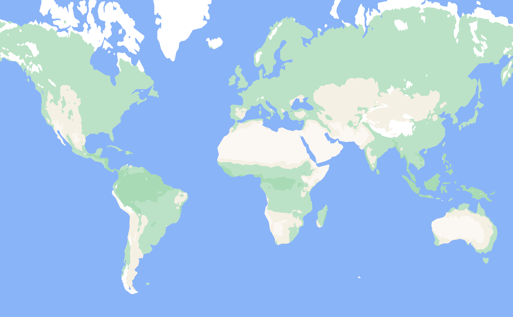

# Median Filter Landcover

A challenge when generating low-resolution vector tiles from higher-resolution raster data is the downsampling. At low zooms, the user should only see the most important features. Usually polygon simplification is used for this process, however, when doing polygon simplification on very fine structured data the approach leads to sharp edges in the polygons and also features drop out when they get too small.

To mitigate these drawbacks of polygon simplification, one can first blur the raster images with a median filter before polygonizing them. This removes visual components with a high spatial frequency and makes the images suitable for large-scale overviews at low zoom levels.

To make a small proof-of-concept of this idea, we take here a 1-km resolution global climate zone dataset from Beck et al. (2018) and generate a vector landcover dataset from it for the zoom levels z1 to z6.

## Demo

https://wipfli.github.io/median-filter-landcover

<a href="https://wipfli.github.io/median-filter-landcover"></a>

## Source Data Legend

```
Legend linking the numeric values in the maps to the Köppen-Geiger classes.
The RGB colors used in Beck et al. [2018] are provided between parentheses.

    1:  Af   Tropical, rainforest                  [0 0 255]
    2:  Am   Tropical, monsoon                     [0 120 255]
    3:  Aw   Tropical, savannah                    [70 170 250]
    4:  BWh  Arid, desert, hot                     [255 0 0]
    5:  BWk  Arid, desert, cold                    [255 150 150]
    6:  BSh  Arid, steppe, hot                     [245 165 0]
    7:  BSk  Arid, steppe, cold                    [255 220 100]
    8:  Csa  Temperate, dry summer, hot summer     [255 255 0]
    9:  Csb  Temperate, dry summer, warm summer    [200 200 0]
    10: Csc  Temperate, dry summer, cold summer    [150 150 0]
    11: Cwa  Temperate, dry winter, hot summer     [150 255 150]
    12: Cwb  Temperate, dry winter, warm summer    [100 200 100]
    13: Cwc  Temperate, dry winter, cold summer    [50 150 50]
    14: Cfa  Temperate, no dry season, hot summer  [200 255 80]
    15: Cfb  Temperate, no dry season, warm summer [100 255 80]
    16: Cfc  Temperate, no dry season, cold summer [50 200 0]
    17: Dsa  Cold, dry summer, hot summer          [255 0 255]
    18: Dsb  Cold, dry summer, warm summer         [200 0 200]
    19: Dsc  Cold, dry summer, cold summer         [150 50 150]
    20: Dsd  Cold, dry summer, very cold winter    [150 100 150]
    21: Dwa  Cold, dry winter, hot summer          [170 175 255]
    22: Dwb  Cold, dry winter, warm summer         [90 120 220]
    23: Dwc  Cold, dry winter, cold summer         [75 80 180]
    24: Dwd  Cold, dry winter, very cold winter    [50 0 135]
    25: Dfa  Cold, no dry season, hot summer       [0 255 255]
    26: Dfb  Cold, no dry season, warm summer      [55 200 255]
    27: Dfc  Cold, no dry season, cold summer      [0 125 125]
    28: Dfd  Cold, no dry season, very cold winter [0 70 95]
    29: ET   Polar, tundra                         [178 178 178]
    30: EF   Polar, frost                          [102 102 102]

Please cite Beck et al. [2018] when using the maps in any publication:

    Beck, H.E., N.E. Zimmermann, T.R. McVicar, N. Vergopolan, A. Berg, E.F. Wood:
    Present and future Köppen-Geiger climate classification maps at 1-km resolution,
    Nature Scientific Data, 2018.
```

## Requirements

Python, OpenCV, GDAL, java

## Steps

First, generate the `.gpkg` files with GDAL.

Run once:

`python3 recolor.py`

Repeat for `ksize=9, 17, 33, 65` the following steps:

* `python3 filter.py`
* `python3 add_projection.py`
* `python3 polygonize.py`
* `python3 zip.py`

Then go to the `planetiler` folder and run:

```bash
./mvnw clean package --file standalone.pom.xml
java -cp target/*-with-deps.jar com.onthegomap.planetiler.examples.SwissMap --maxzoom=6
```

Local development:

`npx serve .`, then open the browser in http://localhost:3000/

## Technical Problems

* Far away from the equator like for example the arctic, pixels get visible. Probably because the source data and vectorization happens in WGS:84 and the rendering in web mercator.
* The median filter can create visual land bridges at straights where there actually should be a water gap.
* Polygon simplification does not preserve boundaries between polygons, so there are some small gaps between polygons sometimes.
* Laptop had a segfault with `ksize < 9`, and polygonization gets slow for small `ksize`s.

## Cartographic Problems

* Unclear how to switch to another data source like for example OSM beyond zoom level z6.
* North of Europe looks empty. Maybe add forests from a landcover data set.
* Mountain ranges not so visible. Maybe add vector hillshade.

## Summary

Median filter on high-resolution raster images seems like the way to go to have low-zoom vector tiles. It works well together with traditional polygon simplification and tuning the visual result is intuitive.
